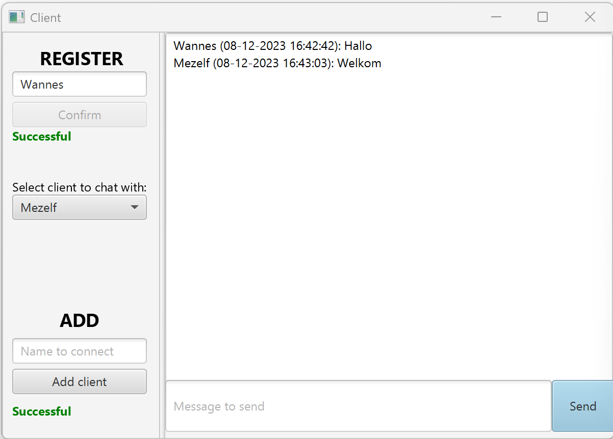

# Project - GS

## Bulletin board
Gebaseerd op volgende [paper](./abb-wpes.pdf)

## Keuzes
Om te beginnen moet er een unieke (gebruikers)naam gekozen worden. Hiermee wordt de _client_ geregistreerd.

Vervolgens kan deze _client_ connectie maken met andere clients aan de hand van hun (gebruikers)naam. Eenmaal toegevoegd moet er in het dropdownmenu gekozen worden naar wie men een bericht wil sturen. 

De optie "everybody" toont alle berichten die reeds verstuurd werden naar de gebruiker. Wanneer een specifieke andere _client_ gekozen wordt, krijg de gebruiker enkel de berichten te zien van deze ene _client_.

Naar "everybody" kunnen er geen berichten gestuurd worden.

## Screenshot

## Opstarten
1. De _server_ moet eerst opgestart worden. Hiervan mag er maar één instantie draaien.
2. Vervolgens kan de _client_ opgestart worden. Hiervan kunnen er meerdere services gelijktijdig draaien.